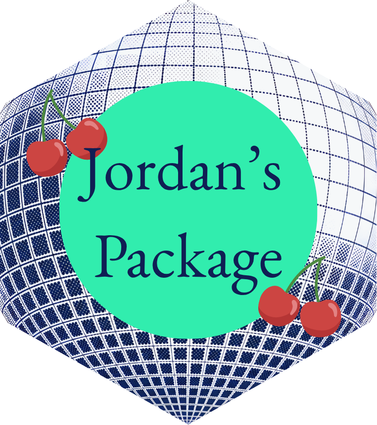

```{r, include = FALSE}
knitr::opts_chunk$set(
  collapse = TRUE,
  comment = "#>",
  fig.path = "man/figures/README-",
  out.width = "100%"
)
```

# jordan.package


The goal of jordan.package is to help reduced redundant code in the data science process. The different aspects of this package span from EDA, Data Cleaning, and Modeling.


## Installation

You can install the development version of jordan.package from [GitHub](https://github.com/) with:

``` r
# install.packages("pak")
pak::pak("jordanea2024-beep/jordan.package")
```

## Features 

* `jea_theme()`
In EDA, we tend to do intentional plots (labeled as quick and dirty) that can often be minimal just to understand the data. However, by adding in `jea_theme()` it can in one line elevate the theme, and make it unique to other group members. It takes the basics of `theme_bw()` and adds elements that match its theme. For example `theme_bw()` puts a box around the chart, so `jea_theme()` adds a box around the legend. `jea_theme()` also centered the title, subtitle, captions, and legends to keep everything aligned. By keeping everything centered the non-data portions of the visualization are symmetric, letting the data part of the visualization stand out. Lastly, `jea_theme()` uses the font "EB Garamond" to make the visualization look more formal.  

* `make_conf_matrix()`
When making a classier model (logistic regression, classifier trees, random forest) it can be useful to make a confusion matrix. A confusion matrix compares the models predictions to the actual values given. In this function, it can be done simply given the model, the data that you want to test the model on, and the column of the data that is the predictor (in $ notation). When testing models, the process to make these confusion can be repeated so this function simplifies that process as multiple models are being tested. 

* `prop_by_cat()`
When given a dataset with multiple categorical variables, many times we want to find the proportion of a category according to the total of a different category. This function makes a new data frame of the proportions of the input category by a different category. These proportions can be useful for understanding the overall groupings of a dataset. 

* `add_prop_to_df()`
If we want to add the proportions of these two categorical variables back to the original dataset, instead of `prop_by_cat()` we can call `add_prop_to_df()`. By adding the proportions back to the original data, we can then use this as a variable to account for in modeling. 

* Examples:
```{r}
#Packages for examples
library(tidyverse)
library(jordan.package)
```


```{r}
df <- data.frame( row_id = 1:10, 
                  category_a = c("A", "A", "B", "B", "C", "C", "D", "D", "E", "E"), 
                  category_b = c("1", "2", "3", "1", "1", "2", "2", "3", "1", "1"))
#jea_theme()
ggplot(df, aes(x = category_a, 
               fill = category_b)) +
  geom_bar(postion = "fill") + 
  jea_theme() + 
  scale_fill_manual(values = jea_colors)

#make_conf_matrix() 
df <- df %>% 
  mutate(is_A_bin = ifelse(category_a == "A", 1, 0))
my_model <- glm(data = df, is_A_bin ~ category_b + row_id, family = "binomial")

my_conf_matrix <- make_conf_matrix(my_model, df, df$is_A_bin)
print(my_conf_matrix)

#prop_by_cat()
new_df <- prop_by_cat(df, "category_a", "category_b")
print(new_df)

#add_prop_to_df()
new_df2 <- add_prop_to_df(df, "category_a", "category_b")
print(new_df2)
```


## Branding 



This logo includes a dark blue disco patterned background and cherries, two of the namesake Jordan's favorite things. This aligns with the overall purpose of the package, as it it tailored to my typical workflow. It also includes the greens and blues that align with my colors, only a a few shade differences to make the colors in the theme accessible. 

To complement my theme and my package, the colors `jea_colors` can be used in plotting. More information on colors can be found in the `_brand.yml` file. 

## Learn More 

If you would like to learn more about the package and its functions you check out `my-vignette.Rmd`. To learn more about a particular function call: 

`?prop_by_cat`
`?add_prop_to_df`
`?make_conf_matrix`
`?jea_theme`

