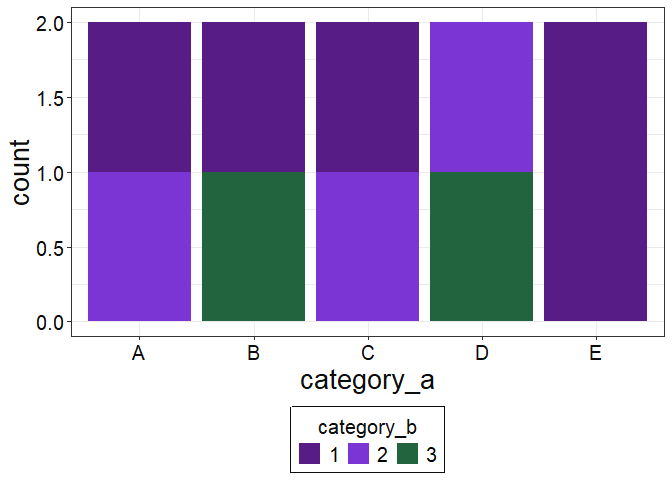

# jordan.package

The goal of jordan.package is to help reduced redundant code in the data
science process. The different aspects of this package span from EDA,
Data Cleaning, and Modeling.

## Installation

You can install the development version of jordan.package from
[GitHub](https://github.com/) with:

``` r
# install.packages("pak")
pak::pak("jordanea2024-beep/jordan.package")
```

## Features

- `jea_theme()` In EDA, we tend to do intentional plots (labeled as
  quick and dirty) that can often be minimal just to understand the
  data. However, by adding in `jea_theme()` it can in one line elevate
  the theme, and make it unique to other group members. It takes the
  basics of `theme_bw()` and adds elements that match its theme. For
  example `theme_bw()` puts a box around the chart, so `jea_theme()`
  adds a box around the legend. `jea_theme()` also centered the title,
  subtitle, captions, and legends to keep everything aligned. By keeping
  everything centered the non-data portions of the visualization are
  symmetric, letting the data part of the visualization stand out.
  Lastly, `jea_theme()` uses the font “EB Garamond” to make the
  visualization look more formal.

- `make_conf_matrix()` When making a classier model (logistic
  regression, classifier trees, random forest) it can be useful to make
  a confusion matrix. A confusion matrix compares the models predictions
  to the actual values given. In this function, it can be done simply
  given the model, the data that you want to test the model on, and the
  column of the data that is the predictor (in \$ notation). When
  testing models, the process to make these confusion can be repeated so
  this function simplifies that process as multiple models are being
  tested.

- `prop_by_cat()` When given a dataset with multiple categorical
  variables, many times we want to find the proportion of a category
  according to the total of a different category. This function makes a
  new data frame of the proportions of the input category by a different
  category. These proportions can be useful for understanding the
  overall groupings of a dataset.

- `add_prop_to_df()` If we want to add the proportions of these two
  categorical variables back to the original dataset, instead of
  `prop_by_cat()` we can call `add_prop_to_df()`. By adding the
  proportions back to the original data, we can then use this as a
  variable to account for in modeling.

- Examples:

``` r
#Packages for examples
library(tidyverse)
#> ── Attaching core tidyverse packages ──────────────────────── tidyverse 2.0.0 ──
#> ✔ dplyr     1.2.1     ✔ readr     2.2.0
#> ✔ forcats   1.0.1     ✔ stringr   1.6.0
#> ✔ ggplot2   4.0.3     ✔ tibble    3.3.1
#> ✔ lubridate 1.9.5     ✔ tidyr     1.3.2
#> ✔ purrr     1.2.2     
#> ── Conflicts ────────────────────────────────────────── tidyverse_conflicts() ──
#> ✖ dplyr::filter() masks stats::filter()
#> ✖ dplyr::lag()    masks stats::lag()
#> ℹ Use the conflicted package (<http://conflicted.r-lib.org/>) to force all conflicts to become errors
library(jordan.package)
```

``` r
df <- data.frame( row_id = 1:10, 
                  category_a = c("A", "A", "B", "B", "C", "C", "D", "D", "E", "E"), 
                  category_b = c("1", "2", "3", "1", "1", "2", "2", "3", "1", "1"))
#jea_theme()
ggplot(df, aes(x = category_a, 
               fill = category_b)) +
  geom_bar(postion = "fill") + 
  jea_theme() + 
  scale_fill_manual(values = jea_colors)
#> Warning in geom_bar(postion = "fill"): Ignoring unknown parameters: `postion`
#> Warning: The `size` argument of `element_rect()` is deprecated as of ggplot2 3.4.0.
#> ℹ Please use the `linewidth` argument instead.
#> ℹ The deprecated feature was likely used in the jordan.package package.
#>   Please report the issue at
#>   <https://github.com/jordanea2024-beep/jordan.package/issues>.
#> This warning is displayed once per session.
#> Call `lifecycle::last_lifecycle_warnings()` to see where this warning was
#> generated.
#> Warning in grid.Call(C_stringMetric, as.graphicsAnnot(x$label)): font family
#> not found in Windows font database
#> Warning in grid.Call(C_stringMetric, as.graphicsAnnot(x$label)): font family
#> not found in Windows font database
#> Warning in grid.Call(C_textBounds, as.graphicsAnnot(x$label), x$x, x$y, : font
#> family not found in Windows font database
#> Warning in grid.Call(C_textBounds, as.graphicsAnnot(x$label), x$x, x$y, : font
#> family not found in Windows font database
#> Warning in grid.Call.graphics(C_text, as.graphicsAnnot(x$label), x$x, x$y, :
#> font family not found in Windows font database
#> Warning in grid.Call.graphics(C_text, as.graphicsAnnot(x$label), x$x, x$y, :
#> font family not found in Windows font database
#> Warning in grid.Call.graphics(C_text, as.graphicsAnnot(x$label), x$x, x$y, :
#> font family not found in Windows font database
#> Warning in grid.Call.graphics(C_text, as.graphicsAnnot(x$label), x$x, x$y, :
#> font family not found in Windows font database
```



``` r

#make_conf_matrix() 
df <- df %>% 
  mutate(is_A_bin = ifelse(category_a == "A", 1, 0))
my_model <- glm(data = df, is_A_bin ~ category_b + row_id, family = "binomial")
#> Warning: glm.fit: fitted probabilities numerically 0 or 1 occurred

my_conf_matrix <- make_conf_matrix(my_model, df, df$is_A_bin)
#> 
#> Call:
#> glm(formula = is_A_bin ~ category_b + row_id, family = "binomial", 
#>     data = df)
#> 
#> Coefficients:
#>              Estimate Std. Error z value Pr(>|z|)
#> (Intercept)     39.35  114478.65       0        1
#> category_b2     28.13  378395.42       0        1
#> category_b3    -17.69  202229.82       0        1
#> row_id         -15.67   36675.98       0        1
#> 
#> (Dispersion parameter for binomial family taken to be 1)
#> 
#>     Null deviance: 1.0008e+01  on 9  degrees of freedom
#> Residual deviance: 2.7523e-10  on 6  degrees of freedom
#> AIC: 8
#> 
#> Number of Fisher Scoring iterations: 25
print(my_conf_matrix)
#> Confusion Matrix and Statistics
#> 
#>           Reference
#> Prediction 0 1
#>          0 8 0
#>          1 0 2
#>                                      
#>                Accuracy : 1          
#>                  95% CI : (0.6915, 1)
#>     No Information Rate : 0.8        
#>     P-Value [Acc > NIR] : 0.1074     
#>                                      
#>                   Kappa : 1          
#>                                      
#>  Mcnemar's Test P-Value : NA         
#>                                      
#>             Sensitivity : 1.0        
#>             Specificity : 1.0        
#>          Pos Pred Value : 1.0        
#>          Neg Pred Value : 1.0        
#>              Prevalence : 0.2        
#>          Detection Rate : 0.2        
#>    Detection Prevalence : 0.2        
#>       Balanced Accuracy : 1.0        
#>                                      
#>        'Positive' Class : 1          
#> 

#prop_by_cat()
new_df <- prop_by_cat(df, "category_a", "category_b")
print(new_df)
#> # A tibble: 9 × 5
#>   category_a category_b var_name1 my_total my_prop
#>   <chr>      <chr>          <int>    <int>   <dbl>
#> 1 A          1                  2        1     0.5
#> 2 A          2                  2        1     0.5
#> 3 B          1                  2        1     0.5
#> 4 B          3                  2        1     0.5
#> 5 C          1                  2        1     0.5
#> 6 C          2                  2        1     0.5
#> 7 D          2                  2        1     0.5
#> 8 D          3                  2        1     0.5
#> 9 E          1                  2        2     1

#add_prop_to_df()
new_df2 <- add_prop_to_df(df, "category_a", "category_b")
print(new_df2)
#>    row_id category_a category_b is_A_bin var_name1 my_total my_prop
#> 1       1          A          1        1         2        1     0.5
#> 2       2          A          2        1         2        1     0.5
#> 3       3          B          3        0         2        1     0.5
#> 4       4          B          1        0         2        1     0.5
#> 5       5          C          1        0         2        1     0.5
#> 6       6          C          2        0         2        1     0.5
#> 7       7          D          2        0         2        1     0.5
#> 8       8          D          3        0         2        1     0.5
#> 9       9          E          1        0         2        2     1.0
#> 10     10          E          1        0         2        2     1.0
```

## Branding

<figure>

<figcaption aria-hidden="true">Jordan’s Package Logo</figcaption>
</figure>

This logo includes a dark blue disco patterned background and cherries,
two of the namesake Jordan’s favorite things. This aligns with the
overall purpose of the package, as it it tailored to my typical
workflow. It also includes the greens and blues that align with my
colors, only a a few shade differences to make the colors in the theme
accessible.

To complement my theme and my package, the colors `jea_colors` can be
used in plotting. More information on colors can be found in the
`_brand.yml` file.

## Learn More

If you would like to learn more about the package and its functions you
check out `my-vignette.Rmd`. To learn more about a particular function
call:

`?prop_by_cat()` `?add_prop_to_df()` `?make_conf_matrix()`
